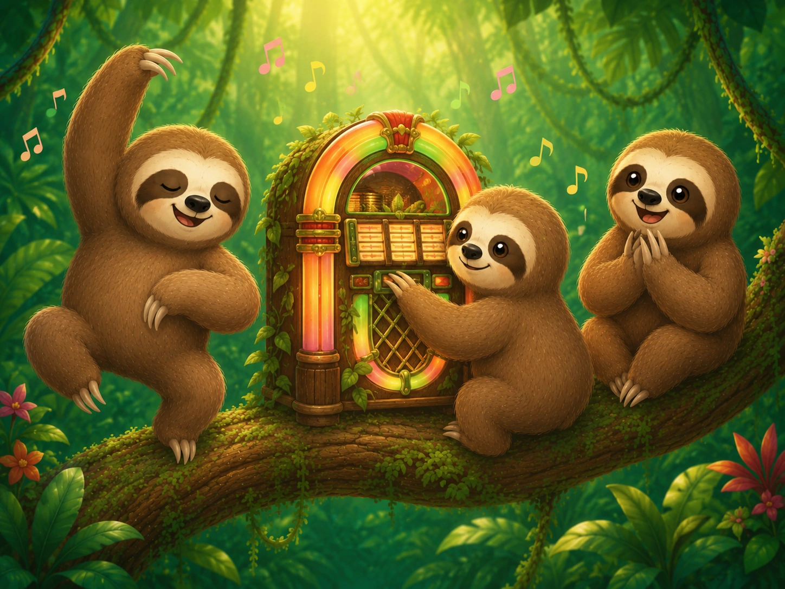
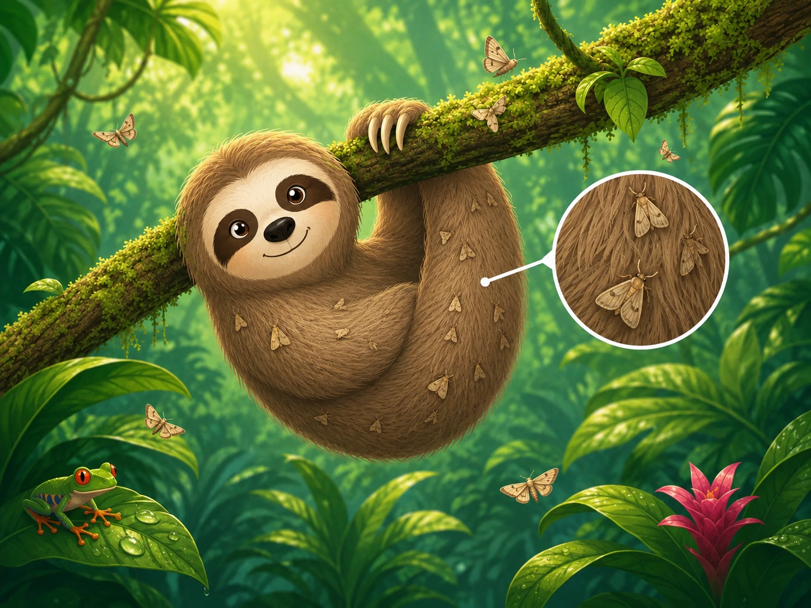

# Codex Task: Complete Image Integration for Sloth Deck

## Goal

Update the image placement in the existing `index.html` deck.

This is the complete and final instruction for the image integration.

Do **not** treat this as a small override.  
Use this document as the full source of truth for all new image placement.

---

## Available image files

The images already exist in the project folder:

```txt
assets/sloth_with_headphones.webp
assets/sloth_reading_with_glasses.webp
assets/mama_and_baby_sloth_reading.webp
assets/sloth_jukebox_party_3_sloths.webp
assets/sloth_with_moths_focus_on_fur.webp
```

Important:

- Do **not** unzip anything.
- Do **not** move files.
- Do **not** embed images as base64.
- Use normal image paths:

```html

```

---

## Global layout rule

Every major image area added by this task must use a full-width **two-image block**.

On desktop/tablet:

```txt
[ image/card 1 ] [ image/card 2 ]
```

On small mobile screens, stacking vertically is allowed.

Use this base structure:

```html
<div class="slide-image-row two-images">
  <figure class="slide-image-card">
    ...
  </figure>

  <figure class="slide-image-card">
    ...
  </figure>
</div>
```

Do not add single lonely image blocks for these new images.

---

## Do not change

Do **not** change or break:

- slide order
- slide navigation
- XP logic
- listening speed buttons
- Play / Stop buttons
- Missing Words
- Order Quiz
- Reading article text
- Reading check logic
- final writing task

This task is only about image placement and cleanup of wrong/duplicate image blocks.

---

# 1. Listening slide

## Required images

The Listening slide must contain these two images together:

```txt
assets/sloth_with_headphones.webp
assets/sloth_jukebox_party_3_sloths.webp
```

Reason:

- `sloth_with_headphones.webp` = listening / audio
- `sloth_jukebox_party_3_sloths.webp` = sound / music / playful audio vibe

## Placement

Place the two-image row after the listening intro card and before the Missing Words section.

Find this area:

```html
<div class="listening-card" id="listeningTask">
  ...
</div>
<div class="listen-divider"><span>Step 2 · Missing words</span></div>
```

Insert this block **between** those two sections:

```html
<div class="slide-image-row listening-image-row two-images">
  <figure class="slide-image-card">
    
  </figure>

  <figure class="slide-image-card">
    
  </figure>
</div>
```

## Cleanup

If `sloth_jukebox_party_3_sloths.webp` was placed on the Final slide by an earlier attempt, remove it from the Final slide.

The jukebox image belongs on the Listening slide.

---

# 2. Reading slide

## Required images

The Reading slide must contain exactly these two new reading images:

```txt
assets/sloth_reading_with_glasses.webp
assets/mama_and_baby_sloth_reading.webp
```

They must share one full-width two-column row.

## Placement

Find this part of the Reading slide:

```html
<h2>A tiny jungle on a sloth</h2>
<p class="lead">Read the text. Write down three things that surprise you.</p>
```

Insert the image row directly after the lead paragraph and before the reading article:

```html
<div class="slide-image-row reading-image-row two-images">
  <figure class="slide-image-card">
    
  </figure>

  <figure class="slide-image-card">
    
  </figure>
</div>
```

## Cleanup

Remove any old/additional image block on the Reading slide that is not part of this two-image row.

The Reading slide should **not** show:

- a third large image
- an old extra image
- a duplicate gallery competing with the new two-image block
- a single full-width image above or below the pair

Keep the Reading article text.

The final Reading slide image area should be:

```txt
[ sloth_reading_with_glasses.webp ] [ mama_and_baby_sloth_reading.webp ]
```

---

# 3. Symbiosis / Who benefits slide

## Required image concept

The Symbiosis / Who benefits slide must focus on:

```txt
assets/sloth_with_moths_focus_on_fur.webp
```

This is the correct image because the slide asks:

```txt
Who benefits?
```

and the image visually explains:

```txt
moths live in the sloth's fur
```

## Important cleanup

There is currently an old left image on this slide that does not match the new premium style.

Remove that old left image.

Do **not** keep the mismatched flat/cartoon left image.

## Layout rule

Even after removing the old left image, the Symbiosis / Who benefits slide must still use a full-width **two-image block**.

Use the same image twice with different crop positions.

This is intentional:

- left card: wider focus on the sloth and fur
- right card: closer focus on the moth/fur callout

## Placement

Place this image row after the Symbiosis / Who benefits lead text and before the benefit statements/questions.

Use:

```html
<div class="slide-image-row symbiosis-image-row two-images">
  <figure class="slide-image-card moths-main-crop">
    
  </figure>

  <figure class="slide-image-card moths-detail-crop">
    
  </figure>
</div>
```

## Important

Do not collapse this into one image.

The slide should look like a two-card visual block:

```txt
[ sloth/fur overview crop ] [ moth/fur close-up crop ]
```

The old mismatched image must be gone.

---

# 4. Final task slide

No new image is required for the Final task slide in this patch.

If a previous attempt added:

```txt
assets/sloth_jukebox_party_3_sloths.webp
```

to the Final task slide, remove it.

The jukebox image belongs on the Listening slide.

Keep the final writing task visible and usable.

---

# 5. CSS for the image blocks

Add this CSS once.

If similar CSS already exists, merge carefully and avoid duplicates.

```css
.slide-image-row{
  display:grid;
  gap:16px;
  margin:18px 0 22px;
  position:relative;
  z-index:3;
  width:100%;
}

.slide-image-row.two-images{
  grid-template-columns:repeat(2,minmax(0,1fr));
}

.slide-image-card{
  margin:0;
  border-radius:24px;
  overflow:hidden;
  border:1px solid rgba(216,233,221,.95);
  background:#f6fff5;
  box-shadow:0 16px 34px rgba(16,41,31,.12);
  min-width:0;
}

.slide-image-card img{
  display:block;
  width:100%;
  height:clamp(220px,26vw,340px);
  object-fit:cover;
}

.listening-image-row .slide-image-card img{
  height:clamp(220px,26vw,350px);
}

.reading-image-row .slide-image-card img{
  height:clamp(220px,25vw,340px);
}

.symbiosis-image-row .slide-image-card img{
  height:clamp(220px,26vw,350px);
}

/* Same moth/fur source image, different useful crops */
.moths-main-crop img{
  object-position:36% center;
}

.moths-detail-crop img{
  object-position:73% center;
}

@media(max-width:760px){
  .slide-image-row.two-images{
    grid-template-columns:1fr;
  }

  .slide-image-card img,
  .listening-image-row .slide-image-card img,
  .reading-image-row .slide-image-card img,
  .symbiosis-image-row .slide-image-card img{
    height:auto;
    max-height:none;
  }
}
```

---

# 6. Duplicate cleanup rules

Before finishing, search the HTML for these image filenames.

## `sloth_with_headphones.webp`

Should appear only on the Listening slide.

## `sloth_jukebox_party_3_sloths.webp`

Should appear only on the Listening slide.

Do not leave it on the Final task slide.

## `sloth_reading_with_glasses.webp`

Should appear only on the Reading slide.

## `mama_and_baby_sloth_reading.webp`

Should appear only on the Reading slide.

## `sloth_with_moths_focus_on_fur.webp`

Should appear only on the Symbiosis / Who benefits slide.

It may appear twice there because the slide uses the same image twice with different crops.

That is allowed.

---

# 7. Final expected placement

## Listening

```txt
[ sloth_with_headphones.webp ] [ sloth_jukebox_party_3_sloths.webp ]
```

Placed before Missing Words.

## Reading

```txt
[ sloth_reading_with_glasses.webp ] [ mama_and_baby_sloth_reading.webp ]
```

Placed before the Reading article.

No third old Reading image.

## Symbiosis / Who benefits

```txt
[ sloth_with_moths_focus_on_fur.webp overview crop ] [ sloth_with_moths_focus_on_fur.webp detail crop ]
```

The old mismatched left image is removed.

## Final task

No new image from this patch.

Jukebox must not be here.

---

# 8. Final validation checklist

After editing, verify:

## Layout

- All new image areas use `.slide-image-row.two-images`.
- No single-image row was added for these image areas.
- Two cards share the full available width on desktop/tablet.
- They stack only on small mobile screens.

## Listening

- Contains headphones image.
- Contains jukebox image.
- Both appear together before Missing Words.
- Listening controls still work.

## Reading

- Contains glasses-reading sloth.
- Contains mama-and-baby reading sloth.
- Both appear side by side.
- No extra old image remains on the Reading slide.
- Reading article text remains.

## Symbiosis / Who benefits

- Old mismatched left image removed.
- Moth/fur image appears in a two-card block.
- Same image may be used twice with different crop positions.
- Benefit questions remain below or after the image area.

## Final task

- Jukebox image is not on the Final task slide.
- Final writing task remains visible and usable.

## Functionality

Still working:

- Next / Previous
- slide counter
- XP
- speed buttons
- Play / Stop
- Missing Words
- Order Quiz
- Reading check
- Final writing task
